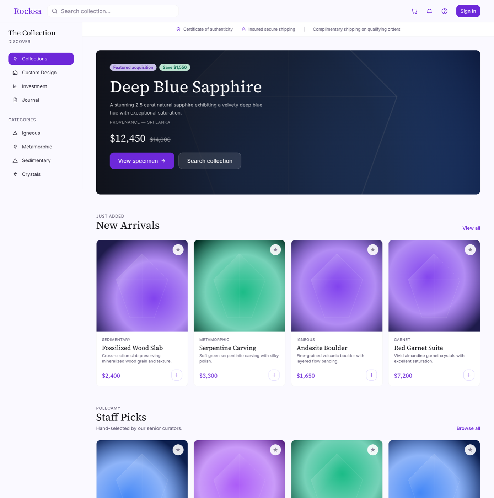
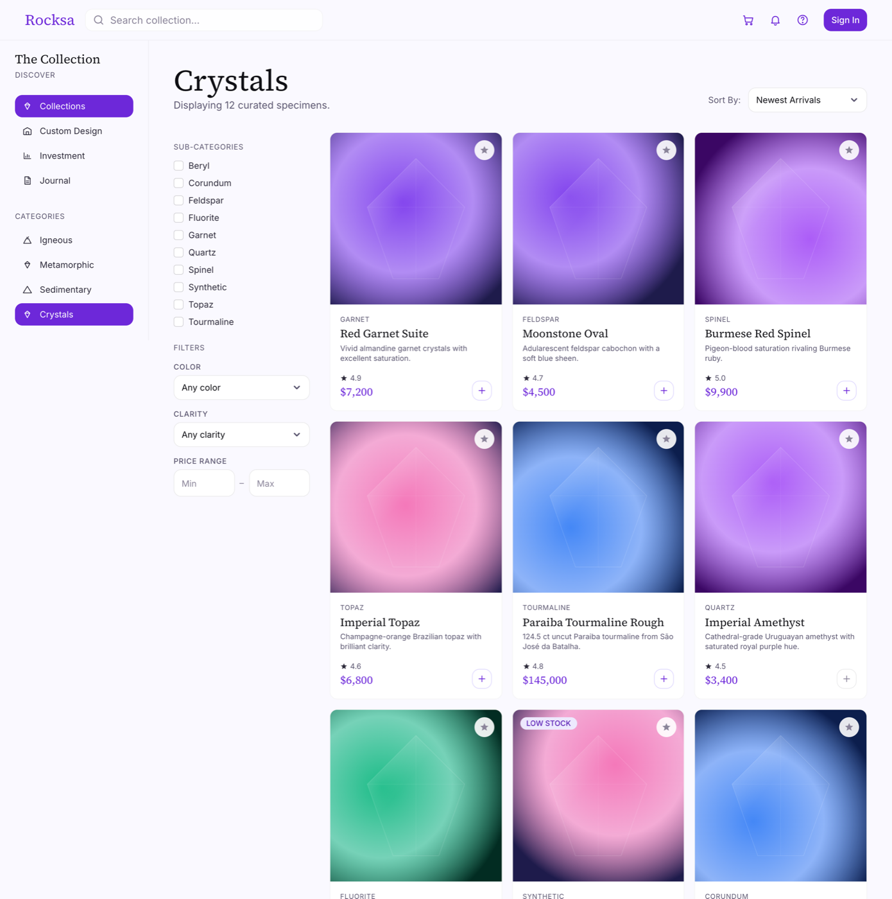
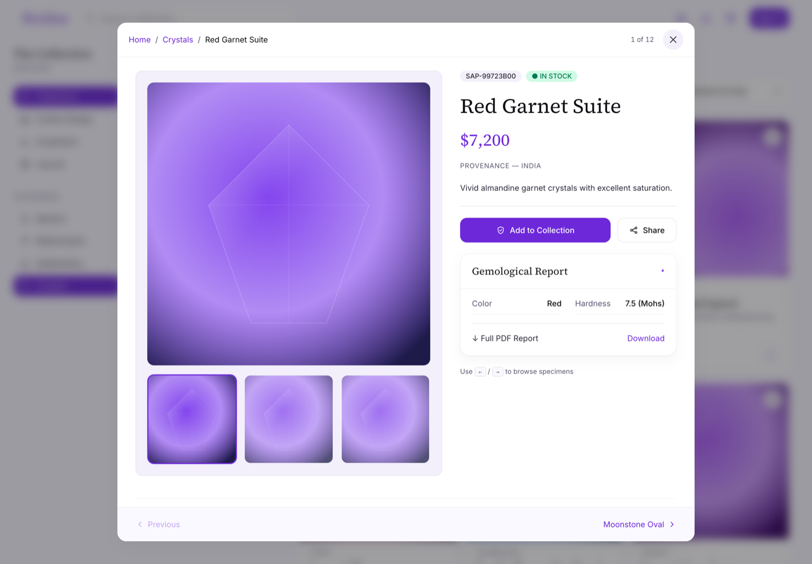
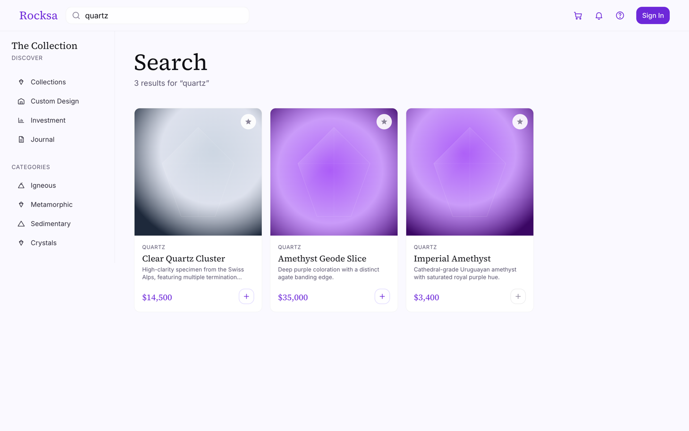
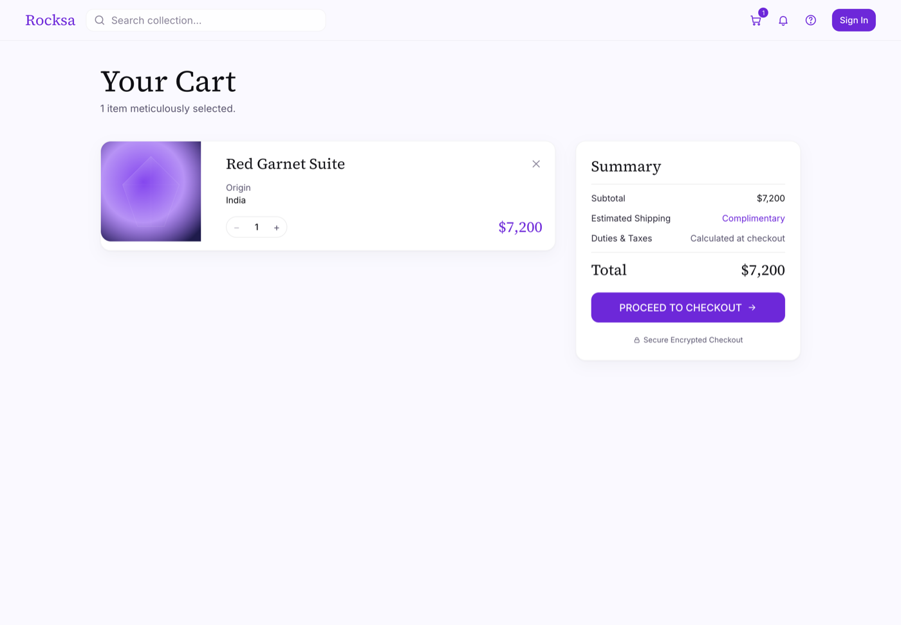
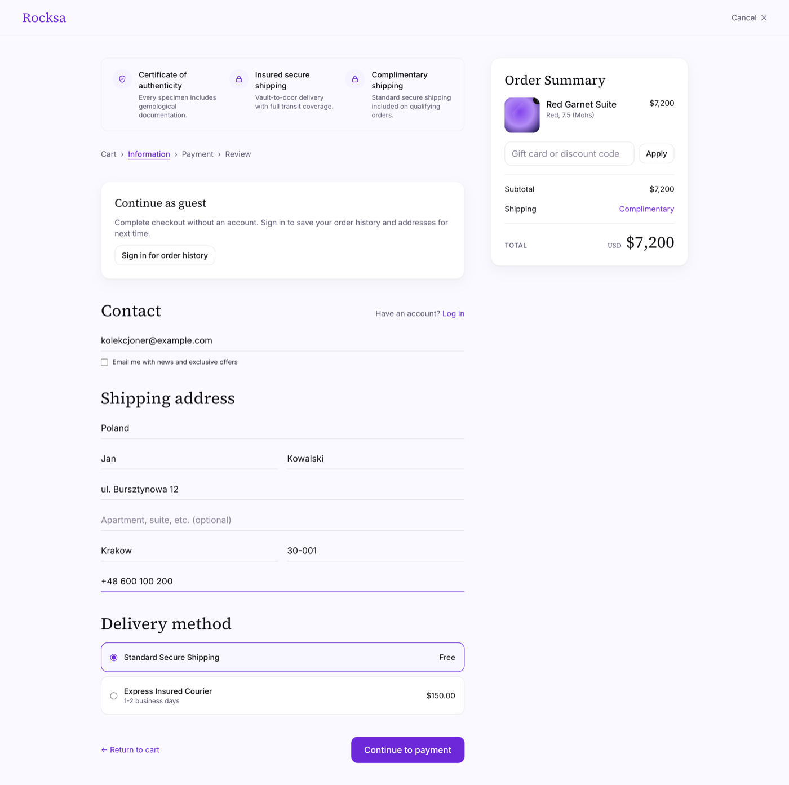
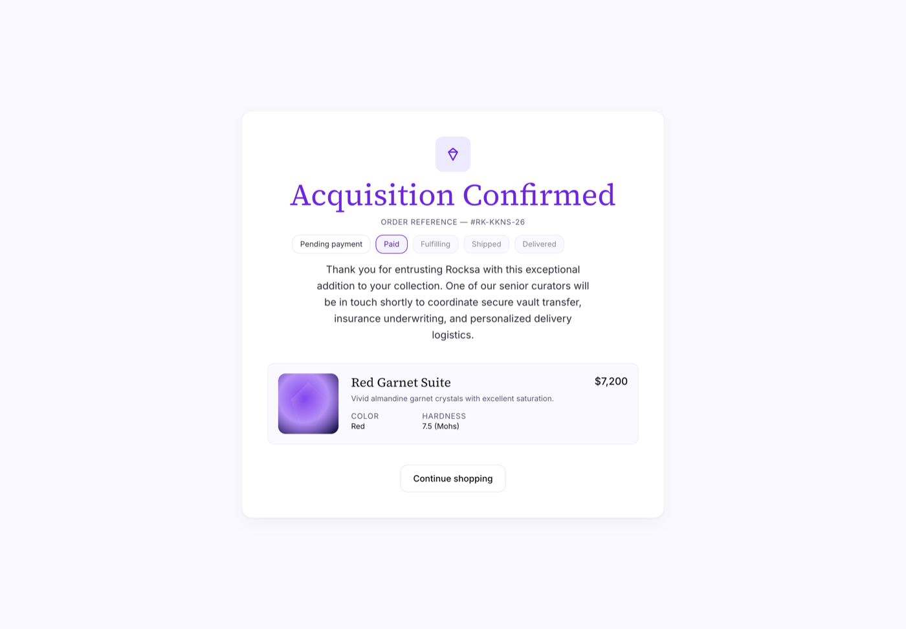
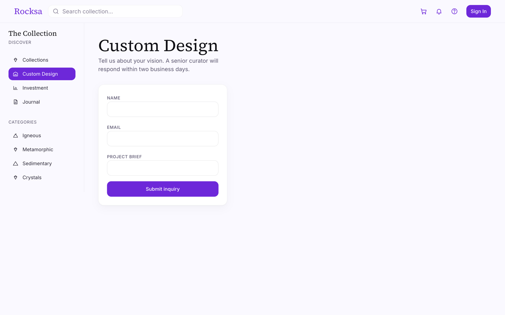

# Rocksa

A luxury gemstone & mineral marketplace: React storefront, Hono API, Postgres, Firebase Auth.

## Stack

Bun · React 19 · TanStack Router · TanStack Query · Tailwind v4 · framer-motion · Firebase Auth · Hono · PostgreSQL 16 + Drizzle · Vitest · Oxlint/oxfmt.

See [`docs/plan/00-overview.md`](./docs/plan/00-overview.md) for the phased build plan.

## Screenshots

**Storefront home**



**Category listing with filters**



**Specimen modal over the listing**



**Search**



**Cart**



**Checkout, step 1 of 3**



**Order confirmation**



**Custom design inquiry**



## Quick start

```bash
bun install
docker compose up -d          # Postgres 16 on :5432
bun run db:migrate            # apply schema
bun run db:seed               # 30 specimens
bun run api                   # API on http://localhost:8787
bun dev                       # web on http://localhost:5173
```

`.env.development` is committed and holds the non-secret dev config (Firebase web keys, `DATABASE_URL`, `VITE_API_URL`). Anything secret, such as a service-account JSON, goes in a local git-ignored `.env`; see [`.env.example`](./.env.example).

Auth runs against the real Firebase project by default. To use the local emulator instead, set `VITE_FIREBASE_AUTH_EMULATOR` and run `bun run emulators:auth`.

## Scripts

| Command               | What it does                          |
| --------------------- | ------------------------------------- |
| `bun dev`             | Run the web app (Vite)                |
| `bun run api`         | Run the API server (watch mode)       |
| `bun run db:generate` | Generate Drizzle migrations           |
| `bun run db:migrate`  | Apply migrations                      |
| `bun run db:seed`     | Seed the catalog                      |
| `bun run build`       | Build every workspace package         |
| `bun run typecheck`   | Type-check every package              |
| `bun test`            | Run Vitest                            |
| `bun run test:auth`   | Firebase Auth end-to-end test         |
| `bun run lint`        | Oxlint                                |
| `bun run fmt`         | oxfmt                                 |

## Layout

```
apps/web            # React SPA (TanStack Router, file-based routes)
apps/api            # Hono REST API on Bun, /v1/*
packages/ui         # Shadcn-derived primitives, Rocksa tokens
packages/auth       # Firebase Auth init, AuthProvider, route guards
packages/cart       # Cart state, local storage plus server sync
packages/domain     # Pure types and functional helpers
packages/db         # Drizzle schema, migrations, seed
packages/config     # Shared tsconfig, Tailwind, oxlint config
docs/plan           # Phased build plan
docs/screenshots    # Screenshots used in this README
docker-compose.yml  # Local Postgres
```

## API

`GET /health` plus routers under `/v1`: `specimens`, `cart`, `orders`, `me`, `collections`, `addresses`, `inquiries`, `workspace`. Protected routes verify a Firebase ID token server-side; workspace routes additionally require the `curator` or `admin` role.
